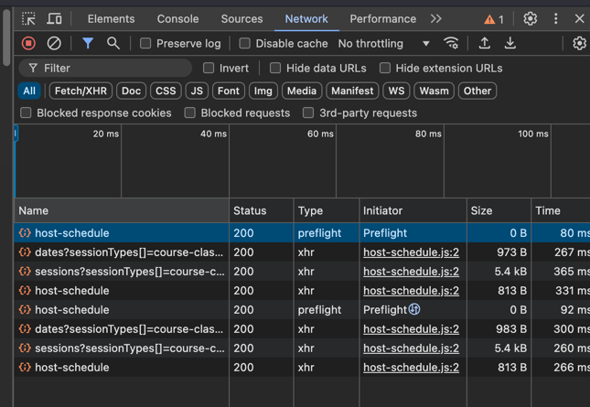
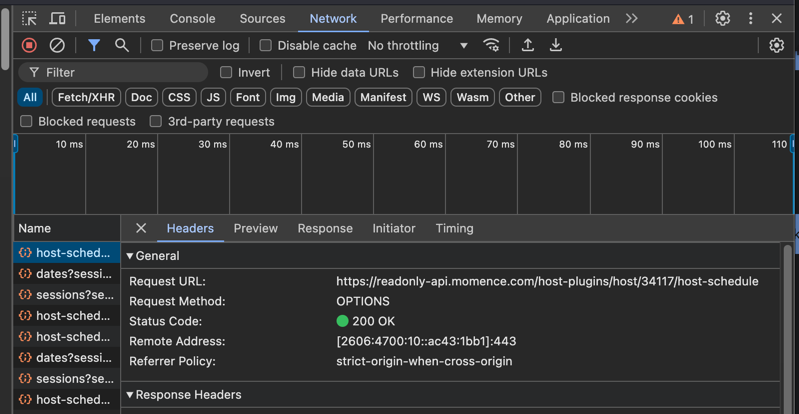

# Momence Calendar Sync

This app serves as a syncing tool to help pull the schedule from Momence into a Google Calendar which can then be shared/synced with others.

## Getting Started

1. Install all dependencies
```
bundle install
```
2. Create a .env file
```
cp env.sample .env
```
3. Update the LOCATION_ADDRESS variable with the physical address

## Find Momence Host ID
1. Navigate to the Momence calendar for the desired host ([Example](https://momence.com/u/vertical-fusion-longmont-UZVCbp))
2. Right click on the page and navigate to "Developer Tools" > "Inspect"
3. Click on the "Network" tab and locate the "host-schedule" call

4. Click on the call and find the ID in the request URL (should look like .../host/**ID**/host-schedule)

5. Add this ID as the MOMENCE_HOST_ID in your .env file

## Set Up Google Calendar
[Source](https://stackoverflow.com/questions/40722687/how-to-set-up-google-calendar-api-using-ruby-client-for-server-to-server-applica)
1. Go to: https://console.developers.google.com/iam-admin/projects
2. Click "+Create Project"
3. Enter a "Project name" and "Project ID" and click "Create"
4. Under "Library" select "Calendar API"
5. Click ">Enable"
6. Return to: https://console.cloud.google.com/projectselector2/iam-admin/serviceaccounts?supportedpurview=project and choose your project
7. Click "+Create Service Account"
8. Enter a "Service account name" and choose a "Role" (I chose "editor")
9. Under the Actions menu, click "Manage Keys"
10. Click "Add Key" > "Create New Key" and select JSON.
11. A JSON file will be downloaded to your computer. Move this file to the root directory of your application and rename to "google_api.json" (or update the GOOGLE_APPLICATION_CREDENTIALS in your .env). 
12. Copy the "client_email" from the JSON file and go to the settings of the Google Calendar that you want this application to access. 
13. Under "Share with specific people or groups", click "Add people and groups". 
14. Add the email you copied and select "Make changes to events" for permissions and save. 
15. Under "Integrate Calendar", copy the "Calendar ID" and paste that in your .env file

## Running the application
```
ruby sync.rb
```

### Requirements

1. Ruby 3.3.0
